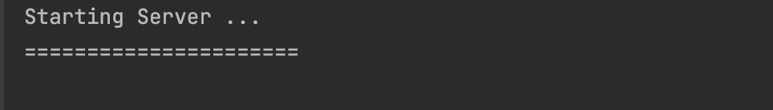
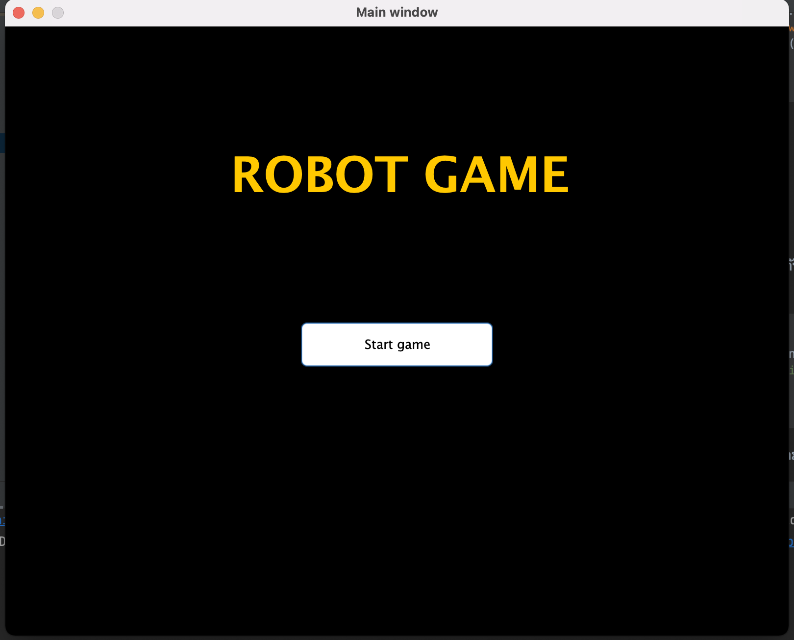
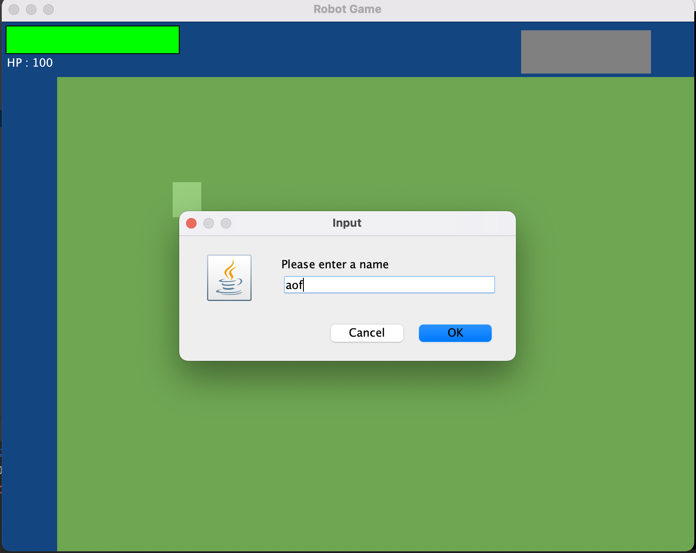
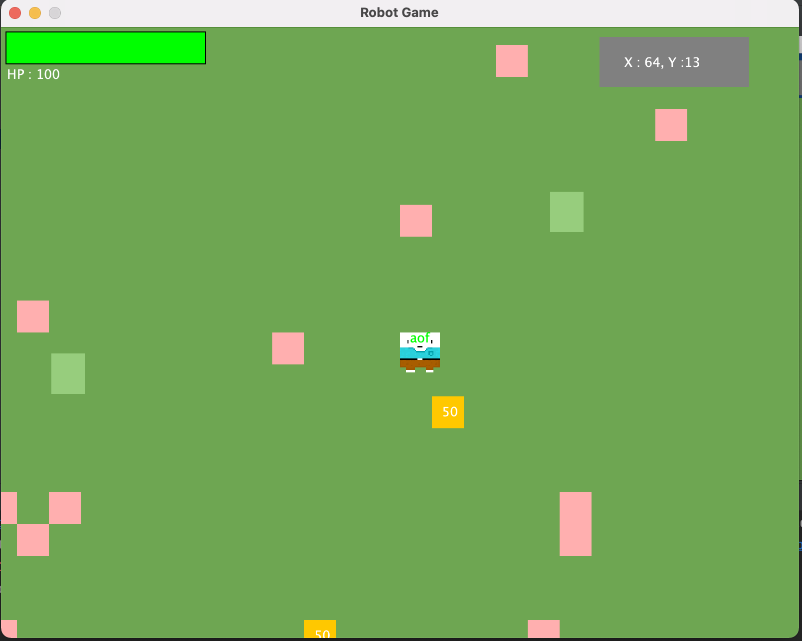
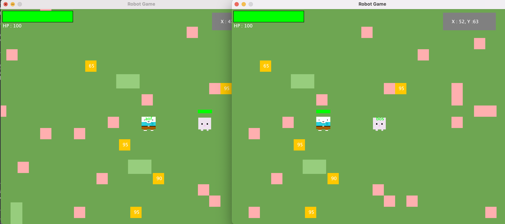

# Java GUI Multi Robot
> งานนี้เป็นส่วนนึงของวิชา css226 OPERATING SYSTEMS

### Member
>> 63090500408 ฐาปณีย์ เรืองรองวรรษ

>> 63090500410 ธนกฤษ แสงสุวรรณ

>> 63090500411 ธัญเทพ ทัศนอนันชัย

>> 63090500416 วุฒิชัย ปิยรุ่งโรจน์

>> 63090500417 สุระวีร์ ใคร่ครวญ

>> 63090500442 อรรถพร พึงสุข


โดย source code ของโปรแกรมนี้ทั้งหมดจะอยู่ภายในโฟรเดอร์ src โดยภายใน โฟรเดอร์นี้จะประกอบด้วย package มากมายที่ใช้ในการทำงานภายในโปรแกรมนี้


### explain package in project
-   `controller` เป็น package สำหรับรวม class ที่ใช้ในการควบคุมการทำงานส่วนมากเช่น ควบคุมเม้าท์ (MouseInput.class) คีย์บอร์ด (MouseInput.class) หรือมุมกล้องต่าง (Camera.class)

-   `entity` เป็น package สำหรับการทำ model ในสำหรับใช้ใน array object ต่างๆ (MyPosition.class)

-   `mainGame` เป็น package สำหรับ รวม class หลักในการทำงาน หรือเป็น class ที่ใช้ในการ run game เป็นหลัก

-   `net` เป็น package สำหรับ การทำงานบน socket โดยจะมี server.class ไว้คอยทำงาน server และมี MainWindow.class ไว้คออยสำหรับทำงานในฝั่ง client

-   `res` เป็น package สำหรับรวม image file ในการใช้ภายในโปรแกรม 


### how to compile and run my code.
1. เมื่อเปิด project มาให้เข้าไปที่ `folder src` ที่รวม package ที่ใช้ในการทำงาน  
2. เลือก `package net` แล้วเลือก Run file `Server.class` เป็นไฟล์แรกเพื่อเปิด server
```java
class Server {
    public static void main(String[] args) throws IOException {

        ServerSocket serverSocket = new ServerSocket(9999);
        Server server = new Server(serverSocket);
        server.startServer();
    }
}
```

**output console**



3. หลังจากนั้นใน package เดียวกันให้ Run file `MainWindow.class` เพื่อทำงานในส่วน Client 

```java
public class MainWindow {
    public static void main(String[] args) {
        new MainWindow("Main window", 800, 650);
    }
}
```


* 3.1 หลังจากนั้นจะขึ้นหน้าต่างเกมสำหรับคลิ๊กเพื่อเริ่มเกม



* 3.2 เมื่อคลิ๊กเข้าไปแล้วนั้นจะมี dialog สำหรับไว้กรอกชื่อของผู้เล่น



* 3.3 เมื่อกรอก name ของ player ไปแล้ว ตัวเเกมจะมีการซุ่มเกิดของตัวละคร พร้อมสุ่มทุ่นระเบิดและ ET
  

4.  หากต้องกการเชื่อมต่อ client2 เข้าไปในเกม ให้ทำการ `setting compiler` ภายใน IDE ให้สามารถ `Allow multiple instance`
      หากใช้ 
     - **IntelliJ** -> Run > `Edit Configurations...` then select the application. Click the Modify options drop-down, and turn on `Allow multiple instances.`
    
      เมื่อ setting ให้เป็น `Allow multiple instances.` จะสามารถ Run ไฟล์เดียวกันโดยสามารถแยกหน้าต่างการทำงานได้ 
  
    4.1.  ให้ทำการ Run `MainWindow.class` จะทำการสร้างตัวละครที่สองเข้าไปในเกม โดยเมื่อเราเเดินไปที่ตำแหน่งของ player 1 ที่ทำการเข้ามาก่อนหน้าแล้ว จะเห็น Bomb และ ET ตำแหน่งเดียวกัน 

    


    


